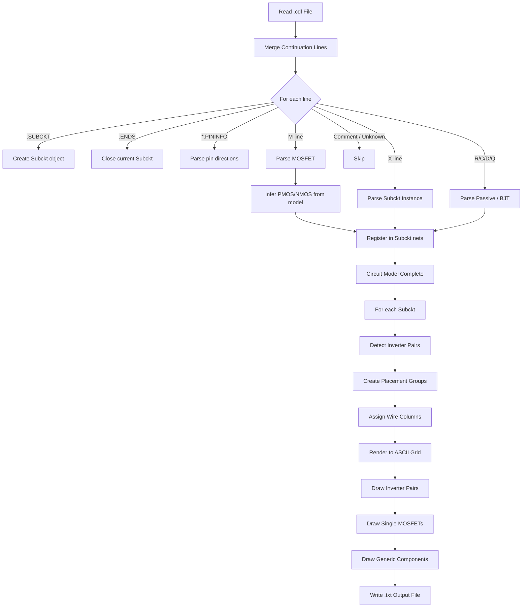
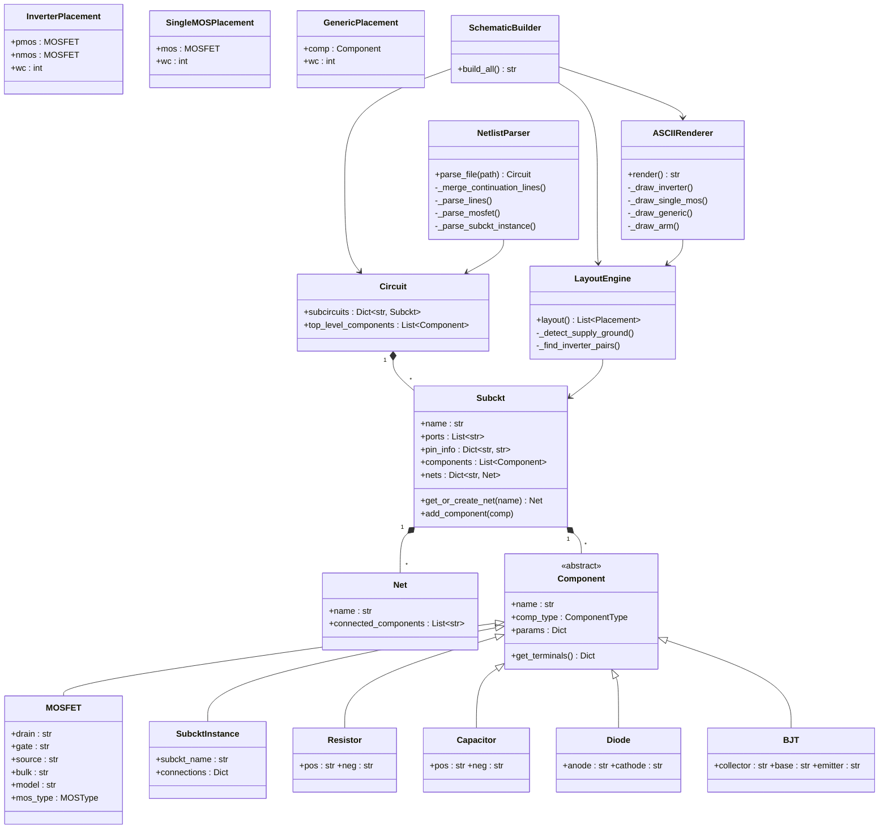

# CDL-to-ASCII Schematic Converter — Design Explanation

## A. Engineering Design Explanation

### 1. Parsing Strategy

The parser operates in two passes over the input file:

1. **Continuation-line merging** — A first sweep joins any line beginning with `+` to its predecessor, producing a list of complete logical lines. This is essential because CDL (and SPICE-family formats) allow a single statement to span multiple physical lines.

2. **Line-by-line dispatch** — Each merged line is classified by its first token:
   - `.SUBCKT` → opens a new subcircuit context.
   - `.ENDS` → closes the current subcircuit.
   - `*.PININFO` → parsed for pin direction metadata.
   - Lines starting with `*` → treated as comments and skipped.
   - Lines starting with `.` (other) → ignored as unsupported directives.
   - `M`, `X`, `R`, `C`, `D`, `Q` → dispatched to component-specific parsers.

Unknown tokens and malformed lines are logged as warnings and skipped — the parser never crashes on bad input.

### 2. Continuation Line Merging

Continuation lines (lines whose first character is `+`) are appended to the most recent non-continuation line with whitespace normalization. This runs before any parsing, so every downstream handler sees only complete, single-line statements.

Edge case: a `+` line with no predecessor is logged and discarded.

### 3. MOSFET Extraction

MOSFET lines follow the standard 4-terminal format:

```
M<name> <drain> <gate> <source> <bulk> <model> [key=value ...]
```

The parser:
- Splits the merged line on whitespace.
- Assigns positional tokens 1–4 to drain, gate, source, and bulk.
- Token 5 is the model name.
- Remaining tokens are scanned for `key=value` pairs and stored in a parameter dictionary.

**Type inference** — The model name is matched against regex patterns for common PMOS/NMOS naming conventions (`lvtpfet`, `nfet`, `pch`, etc.). This classification drives the layout engine's inverter-detection logic. Unrecognised models are tagged `UNKNOWN`.

### 4. Graph Modeling

The circuit is modelled as a bipartite graph:

| Concept       | Graph role | Description |
|---------------|-----------|-------------|
| **Net**       | Node      | An electrical node with a name and list of connected component names. |
| **Component** | Hyper-edge | Connects two or more nets via typed terminals (D, G, S, B for a MOSFET). |

Each `Subckt` maintains a `nets` dictionary that is populated lazily as components are registered. This avoids requiring a separate net-declaration pass and naturally captures internal (unnamed) nodes.

### 5. Layout Design Decisions

The layout engine uses a **deterministic, topology-driven, layered** approach:

1. **Inverter-pair detection** — For every PMOS, the engine searches for an NMOS that shares both gate and drain nets. Matched pairs are rendered as a vertically stacked inverter with proper transistor symbols:

   ```
                VDD
                 |
            ||---+
   Vin --+--o||   |    PMOS
         |   ||---+
         |        |
         |        +---- Vo
         |        |
         |   ||---+
         +---||   |    NMOS
             ||---+
                 |
                VSS
   ```

2. **Remaining MOSFETs** — Placed individually with the same `||---+` transistor symbol, vertical drain/source wires, and a horizontal gate stub (with `o` bubble for PMOS).

3. **Other components** — Rendered as labelled boxes (`[name] subckt_type`) with vertical wire stubs.

Each component group is assigned a **wire column** (`wc`) — the column where the main vertical drain/source wire runs. A fixed `COL_SPACING` (30 characters) separates groups horizontally, preventing overlap.

**Why layered?** Analog and digital standard-cell schematics naturally follow a top-to-bottom power-rail orientation. This matches engineer expectations and keeps the algorithm $O(n)$ in component count.

### 6. ASCII Grid Design & MOSFET Symbol

The renderer allocates a 2-D character array sized to fit all placement groups plus margins. Each MOSFET is drawn using a proper transistor symbol:

- `||` — gate electrode (vertical bars, 3 rows tall)
- `---+` — channel arms connecting gate bars to the main wire column
- `o` — PMOS inversion bubble (placed between gate input wire and `||`)
- `+` — junction where arms meet the vertical drain/source wire
- `-` — horizontal wires (gate input, output stub)
- `|` — vertical wires (supply to drain, source to ground)

Drawing proceeds in dedicated methods per placement type:

1. **`_draw_inverter()`** — Draws the full 15-row inverter stack: supply label, vertical wire, PMOS symbol (top arm, gate row with bubble, bottom arm), output junction with net label, NMOS symbol (top arm, gate row, bottom arm), vertical wire, ground label, and the vertical gate connection wire.

2. **`_draw_single_mos()`** — Draws a 9-row standalone MOSFET with the same symbol style.

3. **`_draw_generic()`** — Draws a `[name]` box with vertical wire stubs.

### 7. Collision Avoidance

Three mechanisms prevent visual corruption:

- **Column-incrementing layout** — Each component group is assigned a wire column that is strictly increasing, structurally preventing horizontal overlap.

- **Dedicated drawing methods** — Each placement type (inverter pair, single MOSFET, generic) has its own drawing method that places characters at pre-computed, non-conflicting positions. No two groups write to the same grid cells.

- **Safe vs. forced writes** — Net labels use `_safe_puts()` which only writes into empty cells, preventing overwriting of wires or components. Component symbols and wires use `_puts()` / `_put()` which write unconditionally at their pre-assigned positions.

### 8. Hierarchy Handling

Subcircuit instances (`X` prefix) are parsed into `SubcktInstance` objects that record:
- The referenced subcircuit name.
- A positional pin-to-net mapping.

During rendering, each `X` instance appears as a labelled box showing the subcircuit name. The tool does **not** recursively flatten hierarchy — each `.SUBCKT` block is rendered independently. This keeps the schematic readable for large designs and mirrors how engineers typically review netlists.

### 9. Tradeoffs and Limitations

| Aspect | Decision | Tradeoff |
|--------|----------|----------|
| Layout algorithm | Column-stacking, inverter-pair detection | Simple and fast, but does not handle complex topologies (e.g., differential pairs, current mirrors) with special placement. |
| Wire routing | Manhattan (H/V only), L-shaped jogs | No channel routing or crossing minimisation; can produce untidy routes for >10 components. |
| Net labels | Heuristic boundary placement | Labels may overlap for very dense schematics; no label-jog algorithm. |
| Hierarchy | Flat per-subcircuit rendering | Cross-subcircuit connectivity is not visualised. |
| Model classification | Regex on model name | May misclassify custom model names that don't follow common conventions. |
| Scalability | $O(n)$ placement, $O(n \cdot g)$ rendering (g = grid area) | Grid area grows linearly with component count; renders are fast up to hundreds of components. |

---

## B. Flowchart (Mermaid Format)



---

## C. Architecture Diagram



### Module Interaction Summary

```
┌──────────────┐     ┌────────────────┐     ┌──────────────┐     ┌───────────────┐
│  CLI / main  │────▶│ NetlistParser  │────▶│ LayoutEngine │────▶│ ASCIIRenderer │
│  (argparse)  │     │  reads .cdl    │     │  grid coords │     │  char grid    │
└──────────────┘     └────────────────┘     └──────────────┘     └───────┬───────┘
                            │                                            │
                            ▼                                            ▼
                     ┌──────────────┐                            ┌──────────────┐
                     │   Circuit    │                            │  .txt file   │
                     │  data model  │                            │  (output)    │
                     └──────────────┘                            └──────────────┘
```
